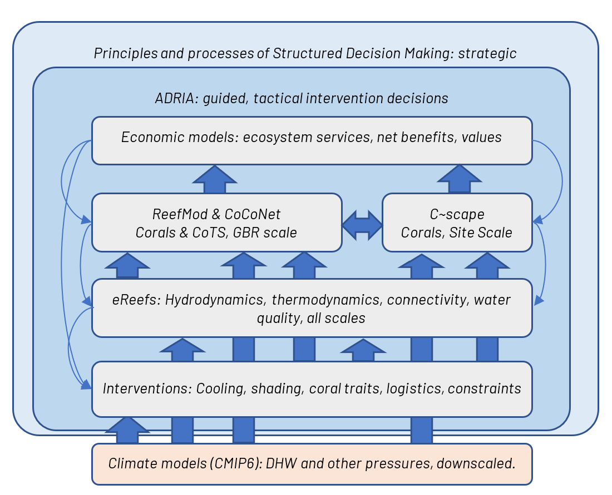
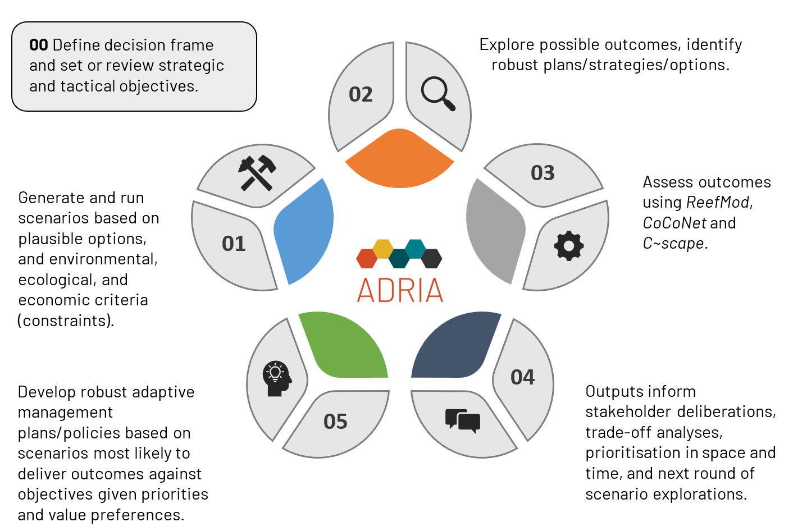

{: .no_toc }

# Reef Interventions

  

    Table of contents
  

{: .text-delta }
* TOC
{:toc}
____

## Intervention Modelling 

The M&DS suite is a collaborative set of environmental, ecological, and economic models working within a decision-support framework. Climate models force the environmental and ecological layers, and influence intervention scope and effectiveness. Scenario analyses of ecological and economic outcomes feedback to inform which intervention strategies and tactics are effective, safe, and robust (Figure 1).

Part of the Decision Support value proposition is the idea that M&DS can identify the best location to undertake RRAP interventions, in identifying locations that will help maximise the likelihood that RRAP actions will deliver benefits, and/or identify locations that will maximise the magnitude of those benefits. Combinations of environmental, ecological, social, and economic drivers are used within the M&DS suite to construct selection criteria and objectives that inform intervention deployment, option construction and portfolio studies. 

This involves a set of nested spatial scales, spanning subregions (100 - 300 km), reef clusters (10 - 30 km), reefs (1-10 km), sites (100 m) and coral seeding densities (1 – 10 m) and includes the following criteria: 
- cluster selection, 
- reef selection,
- site selection and 
- deployment selection. 

M&DS is working towards an operational product for the RRAP Modelling and Decision Support suite by mid-2024. At first, this will consist of the existing environmental, ecological and economics modelling suite linked via ADRIA to provide tactical intervention-deployment advice and guidance principles (Figure 2). In time, the suite will be tailored to analysts with communication products developed from synoptic data and will increasingly allow a broader user community to engage.

Our current priorities to enhance this capabaility include:
- Identifying robust strategic and tactical RRAP intervention options in space and time under climate change and deep uncertainty.
- Understanding intervention risks and identifying paths to intervention risk management.
- Supporting spatial prioritisation of interventions at multiple scales.

Further information on the processes, systems and decisions used to produce intervention models for RRAP are documented in M&DS 2022 Intervention Modelling Report (Adaptus et al., 2022).

***Figure 1.** Schematic representation of Modelling and Decision Support (M&DS) intervention modelling workflow.*

***Figure 2.** Schematic representation of the Modelling and Decision Support operational model for Reef interventions*

## Regional Scale
The M&DS coral models ReefMod and CoCoNet are the data engines for coral dynamics at the GBR scale, both simulating ecological responses to changing environmental conditions and proposed interventions. ReefMod resolves coral metapopulation processes down to the very fine scale of individual coral colonies. Whereas CoCoNet simulates metapopulations at the broader site scale (~10ha), emphasising trophic interactions with CoTS and reef fish.

### RRAP Explorer (ReefMod Engine)

The Reefmod Engine (the Engine) is a software library designed to provide a computationally fast version of ReefMod. More information on ReefMod [here](../../modelling/ecological_mod). The Engine is useful to create bespoke restoration scenarios at the scale of one or more reefs and simulate the expected outcomes relative to a counterfactual that lacks intervention. 

The user can select an appropriate context including any choice of reefs, water quality target, climate change scenario, and some additional management actions if needed including CoTS control and no-anchoring. The results are outputted into spreadsheet revealing expected change in coral cover, disaggregated into 6 major coral classes.

We are working on operationally integrating the Engine with ADRIA for an extended and informed exploration of restoration benefits.

***Figure 3.** Graphical User Interface of the RRAP Explorer (ReefMod Engine).*

More information on the Engine and its Graphical User Interface (GUI) GBR Resilience Management Tool (RMT): [https://www.marinespatialecologylab.org/reefmod-emulator](https://www.marinespatialecologylab.org/reefmod-emulator){:target="\_blank"}

## Reef-cluster Scale
M&DS has a single model called C~scape that captures processes at the within reefs-scale. It links coral colony growth and survival to population-level responses and to physical and environmental spatial layers, creating a seascape of coral populations. The coral life cycle informed by demographic data is the engine for coral growth. It allows us to investigate interventions that influence different coral life stages (Figure 3).

***Figure 4.** Schematic representation of the C~scape framework. C~scape is applied to a reef or cluster of reefs. The reef(s) are divided into units for modelling, referred to as sites. These sites are assigned a carrying capacity which specifies the maximum percentage cover of coral in a polygon, this modulates population growth as coral cover approaches the carrying capacity. The sites have different depths, influencing the populations' exposure to temperature stress. Wave exposure is not fully incorporated but is under development. The C~scape framework incorporates thermal stress variability and connectivity between site population polygons as additional spatial inputs, obtained using the eReefs RECOM model. Each of the sites is initialised with a population of corals consisting of different sizes. The engine driving population growth is an integral projection model (IPM) that describes the coral life cycle, enabling us to project changes in each population of corals over an annual period from time t to time t+1. The simulated transport of coral larvae connects populations.*

## Deployment Risk
M&DS analysts seek to explore, in collaboration with environmental managers and decision-makers, the projected net benefits and risks for the Reef and people under a multitude of intervention scenarios within a multitude of environmental scenarios. We have produced a risk-analysis framework for intervention risk on the basis of potential risks triggered by deployment of RRAP technologies (i.e., risk of reduced coral community diversity resulting from the introduction of enhanced coral species). 

The M&DS suite employs scenario analyses to simulate and evaluate the risk associated with RRAP interventions. These assessments encompass factors such as:
- intervention technology,
- deployment location (spanning regional, reef, cluster, and site scales), 
- temporal considerations, and 
- metrics (metrics include both the benefit (i.e., increased regional live coral cover) and the risk (i.e., diminished functional diversity)). 

This powerful and transparent approach will provide Reef managers and decision makers new quality insight into the opportunities, constraints, risks, and potential trade-offs needed to deliver time critical RRAP outcomes transparently in an uncertain future.

The M&DS subprogram is working closely with the RRAP Intervention Risk Review Group (IRRG) to ensure the requirements of risk characterisation are addressed according to materiality/priority. 

[**RRAP Intervention Risk Review Group**](https://gbrrestoration.org/our-team/advisory-and-working-groups/intervention-risk-review-group/){:target="\_blank"}

## Economic Evaluation
Continuous performance indices (0-1) Reef Tourism Index (RTI), Reef Fisheries Index (RTI) and Reef Condition Index (RCI) are close to being operational. However, RCI underpins non-use benefit valuations and has been the focus of economic analyses within M&DS to date. RCI is comprised of between 3 and 6 metrics, depending on the ecological model, these include: coral cover, coral group diversity, structural complexity, juvenile coral abundance, CoTS cover, and proportion of reef covered by rubble. Further details can be found in M&DS 2022 Interventions Modelling Report (Adaptus et a., 2022). 

The M&DS subprogram applies two common approaches to assessing economic impacts of reef restoration and adaptation interventions:
- Cost-Benefit Analysis (CBA) 
- Regional Economic Impact Analysis (EIA)

While an EIA provides information on how policy interventions affect regional economic activity, a social CBA generates information on gains or losses in net social benefit and their distribution across different segments of society. 

Economic benefit functions combine non-monetary spatiotemporal benefit functions (i.e., RCI) with updated economic value of benefits estimated in monetary terms. This establishes the link between RRAP intervention outcomes to changes in economic value of benefits enjoyed by people. The economic value of benefits of RRAP intervention inputs and outputs are measured by metrics of regional economic activity and in terms of social surplus, respectively (Adaptus et al., 2022).

# References

Adaptus, CSIRO, AIMS, UQ, QUT, R&Z Consulting., 2022. 2021 Intervention Modelling Report – Modelling & Decision Support (M&DS) Subprogram. Reef Restoration and Adaptation Program, Version 1.0. Unpublished. Submitted April 2022.

