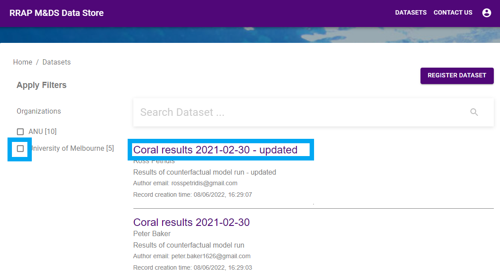

{: .no_toc }
# Viewing a dataset

  

    Table of contents
  

{: .text-delta }
* TOC
{:toc}
____

A dataset can be searched for a number of ways.

If Users know the dataset name, publishing organisation or person the dataset is linked to, then Users can type the known information in the *Search Dataset* field.

Users can also click the *Browse datasets* link located under *Find out more* to be taken to the Datasets page.

On the Datasets page, Users can filter datasets by clicking the check boxes next to the publishing organisation's name. Once a dataset is found, Users then click on the dataset link, this will bring up the Metadata and Dataset Information associated with the dataset. 

From here, Users can download the data, upload additional data and share the data via the Handle link.
