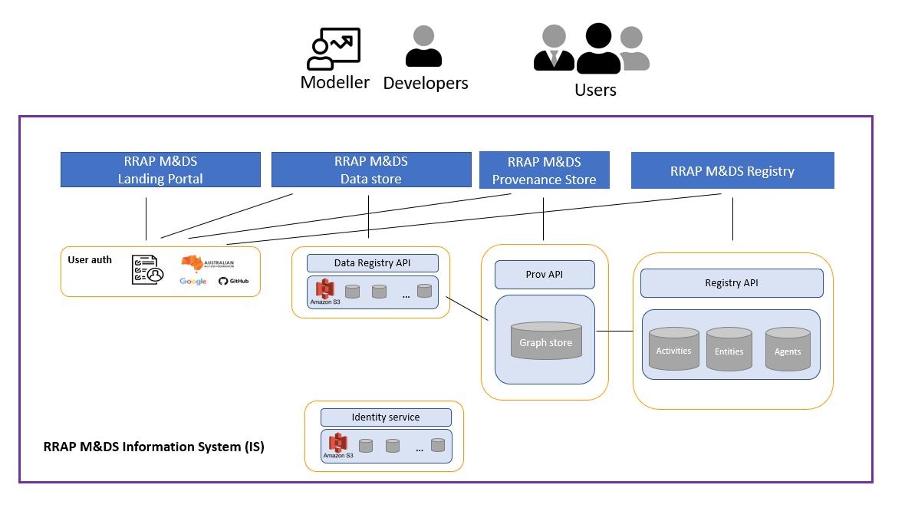
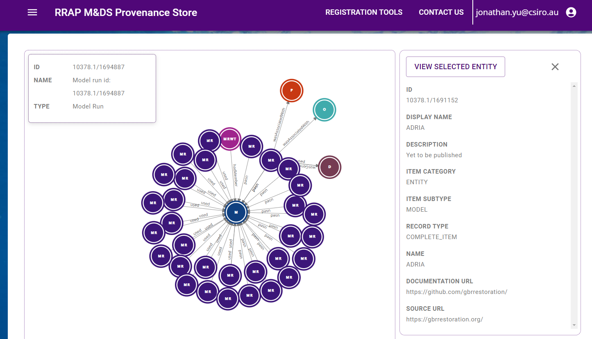

{: .no_toc }
# IS Release v1.0 Clownfish

  

    Table of contents
  

{: .text-delta }
* TOC
{:toc}
____

# 30 November 2022. Release notes RRAP M&DS IS v1.0 "Clownfish"

The RRAP Modelling and Decision Support Information System (RRAP M&DS IS) Version 1.0 has been launched. RRAP M&DS IS is the single point of truth for all data and modelling provenance carried out by the subprogram. It will enable registration and access to relevant data (inputs and results/outputs) and model activity records providing details of the modelling that took place.

The IS will be used to enable access to datasets used in RRAP M&DS (download and access via API), and facilitate transparency and defensibility of the results tabled in reports from RRAP M&DS, e.g. counterfactual & the intervention studies.

RRAP M&DS Information System (IS) v1.0 "Clownfish" release provides users with the ability to login, find out information about the M&DS IS, interface with the RRAP M&DS Data Store and register provenance records for modelling activities.

Refer to previous release notes:
* [v0.1 Anemone release](https://gbrrestoration.github.io/rrap-mds-knowledge-hub/information-system/release-notes/v0-1.html)

## Version 1.0 Release Features

### System Overview
The RRAP M&DS IS Version 1.0 builds on previous releases to complete functionality to allow data and modelling provenance to be captured and made accessible to relevant people.

This release features updates to the current set of components - Landing portal, Data Store, Authorisation APIs, Identity Service, and Documentation. 

New components include:

* **Registry** - enables registration of entities and things required for recording model run provenance records 
* **Provenance store** - facilitates registration of model run provenance records and exploring provenance graphs

Refer to the next section on the use of the **Registry** and **Provenance store** to enable Provenance capture.

The figure below provides a System Architecture overview of the M&DS IS Component.

### Model run provenance capture 

The MDS IS enables users to register model run provenance records linking results and data outputs with relevant information such as the modelling details, input data, and configuration/parameters used. Users achieve this by registering references to modelling artifacts in the Registry and registering provenance of model run records via the Provenance Store. See below for a conceptual model of the provenance details captured for a model run record. 

An example modelling workflow that a user interfaces with the M&DS IS Data Store and Provenance Store is shown below.

Users with access to the provenance store will be able to exploring provenance graphs of modelling activities. A screenshot of a visualisation of a provenance graph allowing users to explore entities and navigate model run lineage is shown below.

Learn more at the [Provenance documentation](https://gbrrestoration.github.io/rrap-mds-knowledge-hub/information-system/data-store/).

### Data Store v1.1

The RRAP M&DS IS Data Store v1.1 provides significant updates that is backwards compatible with Version 1.0 functionality as well as improved user experience on the web portal. The Data Store is now enabled with group and user based access to datasets. Uploaded data continues to be stored in an AWS S3 bucket, which serves as a persistent storage repository. These can be configured by the user to enable access by multiple groups to the dataset.

In addition to the version 1.0 release features, Data Store v1.1 allows users to perform the following:

* Utilise IS groups to enable access to read and/or write metadata and files for the dataset to a defined set of users in the group
* The "Lock dataset" and "Unlock dataset" feature, which allows users to lock datasets from further modification and unlock datasets to allow modification. This is to enable data integrity when datasets are not intended to be modified.

Other updated features include:
* Updated web portal to make them more user friendly - e.g. landing page, view and list datasets 
* Utilise production Handle identifiers
* Rolling backups of modified datasets for 30 days (i.e. users can access previously modified datasets from 30 days of their modification)
* Updated APIs for interacting with the data store

Refer to [Data Store v1.0](https://gbrrestoration.github.io/rrap-mds-knowledge-hub/information-system/release-notes/v0-1.html#data-store-v10) for previous release notes for Data Store.

### Single Sign On and Authorisation

In addition to existing Single-sign-on providers (Australian Access Federation (AAF), Google accounts, and Github), the IS allows Microsoft accounts to be used to authenticate and sign-in. If you have a user account in one of those 4 identity providers, you will be able to access the RRAP M&DS IS and request authorisation to access RRAP M&DS IS tools, such as the Data Store, Registry and Provenance Store.

## Contributors

- Andrew Freebairn
- Daniel Pitson
- Fareed Mirza
- Jonathan Yu
- Linda Thomas
- Mark Hutchins
- Peter Baker
- Ross Petridis
- Sharon Tickell
- Simon Cox
- Stephen van Rees

## Citation

CSIRO (2022), RRAP M&DS Information System Release notes version 1.0 "Clownfish"

# Detailed Release Notes
                                                                                              TBC                                                                                              