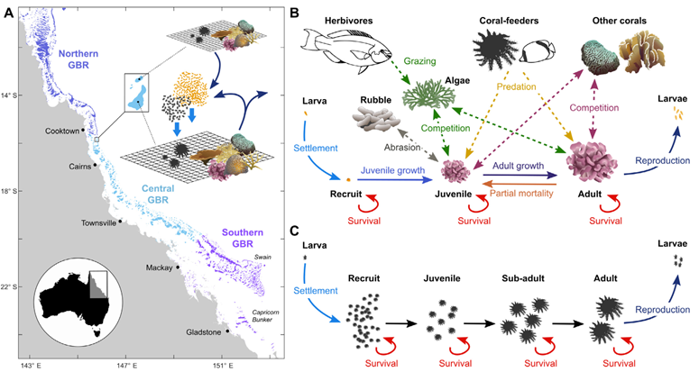

# Reefmod

ReefMod-GBR is a coral metapopulation model that simulates the key demographic processes of corals (reproduction, dispersal, settlement, growth and mortality) and spatially-realistic stressors (water quality, crown-of-thorns starfish outbreaks, cyclones and bleaching) across 3,806 reefs of the GBR (Bozec et al., 2022) (Figure 10). A key feature of the model is that corals are modelled as individual colonies distributed over a spatially-explicit reef surface composed of patches of sand, hard substrates and algae. Six morphological groups of corals are simulated with vital rates derived from GBR field studies and experiments. By simulating realistic coral demographics and disturbance impacts, the model provides a credible reconstruction of recent coral trajectories observed across the GBR (Bozec et al., 2022).

*Schematic representation of the reef ecosystem model applied to the Great Barrier Reef (ReefMod-GBR). (A) Each of the 3,806 individual reefs is represented by a 20x20m horizontal space vertically colonized by coral colonies belonging to six morphological groups. (B) Demographic processes (solid arrows) and ecological interactions (dashed arrows) affecting coral colonies individually. (C) Modelling of crown-of-thorns starfish (CoTS) cohorts subject to size-specific survival during their life. For both corals and CoTS, settlement occurs from a pool of larvae that results from the retention of locally produced offspring (self-supply) and the incoming of larvae from connected reef populations (external supply). (Bozec et al., 2022).*

___

Bozec, Y. M., K. Hock, R. A. B. Mason, M. E. Baird, C. Castro-Sanguino, S. A. Condie, M. Puotinen, A. Thompson, and Mumby, P. J., 2022. Cumulative impacts across Australia’s Great Barrier Reef: A mechanistic evaluation. bioRxiv:1–37.
[Read Here](https://esajournals.onlinelibrary.wiley.com/doi/epdf/10.1002/ecm.1494)